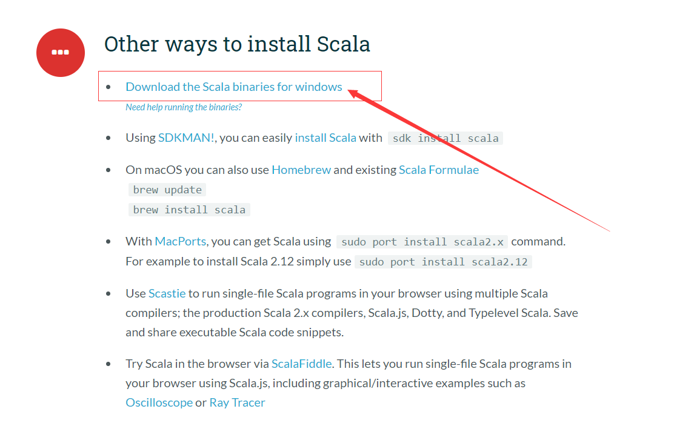
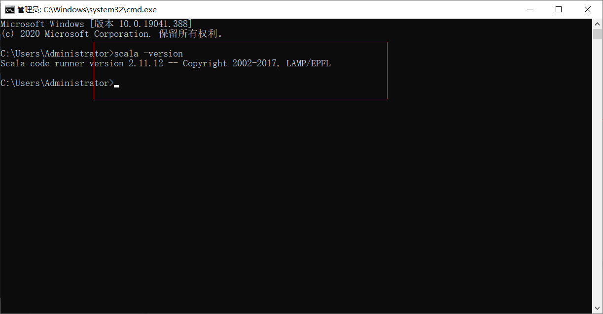
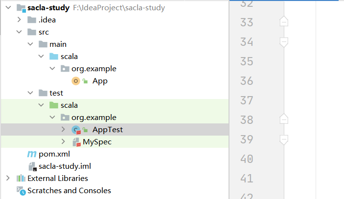

# 开发环境


根据官方指引，它推荐我们使用 idea 去做 Scala 开发，因此我在 idea 中安装相关插件（截图在后面），同时本机环境我们也得去安装一下，方便后续系统调用。

> 注意版本：推荐 2.11.12
>
> 地址：https://www.scala-lang.org/download/2.11.12.html



疯狂下一步，安装完后 **重启电脑** 或者按 **win+r 输入cmd** 

> 注意：一定要win+r



下面是 idea 安装 scla 插件截图，idea 与 pycharm 师出同源，更适合我们做开发。


创建 maven 项目，勾选 scala 案例


> 可能会出现插件安装失败，例如：
>
> ```
> Cannot resolve plugin org.scala-tools:maven-scala-plugin:<unknown>
> ```
>
> 在依赖中添加
>
> ```xml
> <dependency>
>     <groupId>org.scala-tools</groupId>
>     <artifactId>maven-scala-plugin</artifactId>
>     <version>2.11</version>
> </dependency>
> <dependency>
>     <groupId>org.apache.maven.plugins</groupId>
>     <artifactId>maven-eclipse-plugin</artifactId>
>     <version>2.5.1</version>
> </dependency>
> ```



# centos虚拟机

三台虚拟机，推荐使用 [VirtualBox](https://www.virtualbox.org/wiki/VirtualBox)，不推荐 VMware

centos7下载：[阿里云镜像站点](http://mirrors.aliyun.com/centos/7/isos/x86_64/) 下载速度几乎跑满。

